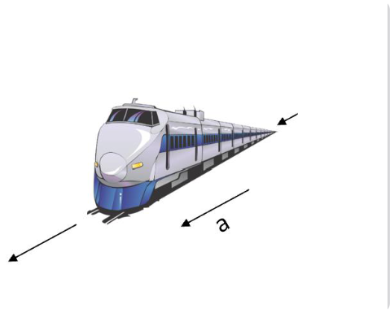
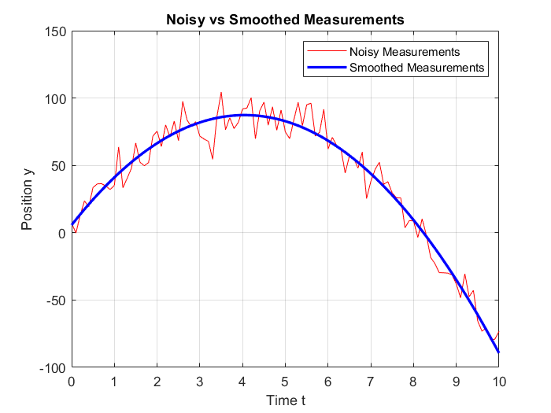

# Least-Squares-and-Kalman-Filter-Estimation
## Least Squares and Kalman Filter Estimation of a Simple Moving Object
This repository presents the implementation and analysis of Least Squares (LS) and Kalman Filter (KF) algorithms for estimating the state vector of a single-dimensional moving object with constant acceleration in MATLAB, using noisy position measurements provided in the dataset. The state vector consists of initial position y(0), initial velocity v(0), and acceleration a. For the LS method, a batch estimation approach was employed to compute the state vector and smoothed positions, with performance evaluated via root mean squared error (RMSE) against ground truth values. The impact of increasing measurement noise on estimation accuracy was also investigated. The KF was implemented iteratively, starting from a zero initial guess, and tuned to converge toward the ground truth. Matrices sizes, and comparative advantages/disadvantages of both methods are discussed. Results demonstrate that both algorithms provide accurate estimates, with KF offering iterative refinement suitable for real-time applications, while LS excels in simplicity for offline processing. 

## Least-Squares estimation
For LS estimation, the solution for the given data set is:
$$
x^{+} = (H^{T}H)^{-1}H^{T}y =
\begin{bmatrix}
5.6976 \\
40.3467 \\
-9.9717
\end{bmatrix}
$$
Smoothed positions are then $$y^{+} = Hx^{+}$$ 

## Kalman Filter Estimation
The KF was implemented iteratively to estimate $x$ using the same data.  
Since the state is constant, the process model used $F = 0$.  
Each measurement was processed sequentially, updating the state estimate from an initial  
$x_0 = [0, 0, 0]^T$ and state error covariance matrix estimate from an initial $P_0$.  
The measurement matrix $H_k$ was row-vector $[1, t_k, 0.5 * t_k^2]$ for each $k$.  
Tuning involved setting  
$P_0 = \mathrm{diag}([50\ 50\ 50])$,  
$Q = \mathrm{diag}([0.001\ 0.001\ 0.001])$,  
$R = 10$,  
and $G = \mathrm{diag}([10\ 10\ 10])$ to achieve convergence.

