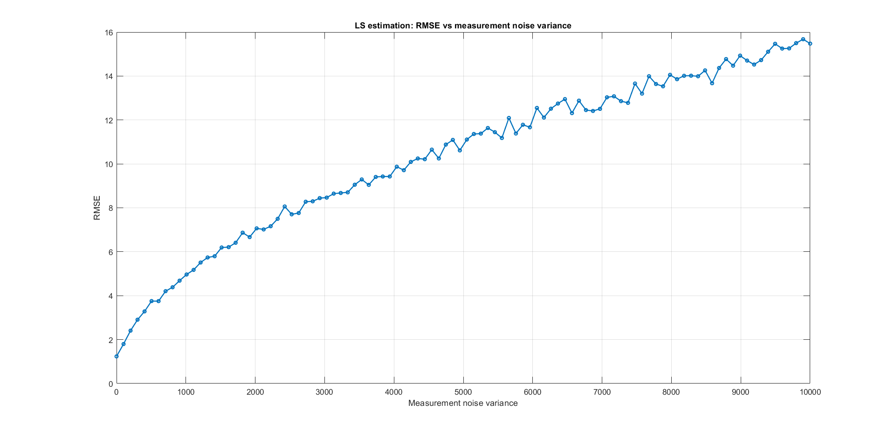

# 🚀 Least Squares and Kalman Filter — State Estimation of a Moving Object

## 🎯 Overview

This project implements and analyzes **Least Squares (LS)** and **Kalman Filter (KF)** algorithms to estimate the state of a **one-dimensional moving object with constant acceleration**.  

The state vector: $( x = [p(0), v(0), a]^T )$
represents the **initial position**, **initial velocity**, and **acceleration** of the object.  

Two estimation methods are compared:
- **Least Squares (LS):** Batch estimation minimizing total residual error  
- **Kalman Filter (KF):** Iterative estimation refining predictions using measurement updates  

The project evaluates both approaches on noisy position measurements and investigates their **accuracy**, **robustness**, and **computational efficiency**.

---

## 📘 Project Description

Given the dataset `data_LS.txt`, which includes:
- Noisy position measurements `y`
- Corresponding time vector `t`

## 🧩 Task 1 – Least Squares (LS) Estimation

### LS Solution
$$
\mathbf{x}^+ = (\mathbf{H}^T\mathbf{H})^{-1}\mathbf{H}^T\mathbf{y}
$$

### Key Results
| Parameter | Estimated | Ground Truth | Unit |
|------------|------------|---------------|------|
| p(0) | 5.6976 | 7.4507 | m |
| v(0) | 40.3467 | 39.1441 | m/s |
| a | -9.9717 | -9.7340 | m/s² |

**RMSE (state vector):** 1.2351  

### Noise Sensitivity
Monte Carlo simulations (200 runs) were used to analyze the relationship between measurement noise variance and estimation RMSE.

📈 **Figure:** Measurement noise variance vs RMSE  
Shows that LS accuracy degrades as measurement noise increases.

### Performance
- Matrix size: $( \mathbf{H} \in \mathbb{R}^{101×3})$
- Average runtime: **13 μs**

---

## 🔁 Task 2 – Kalman Filter (KF) Estimation

### Filter Initialization
$$
x_0 = [0,\ 0,\ 0]^T,\quad
P_0 = diag([50,\ 50,\ 50]),\quad
Q = diag([0.001,\ 0.001,\ 0.001]),\quad
R = 10
$$

### Results
- KF estimates start from zero and converge to ground truth.  
- Final **RMSE = 0.4573**  

📊 **Figure:** Kalman Filter Estimates vs Ground Truth  
Demonstrates rapid convergence and smooth performance.

---

## ⚖️ Comparison: LS vs KF

| Feature | Least Squares (LS) | Kalman Filter (KF) |
|----------|-------------------|-------------------|
| **Computation** | Batch (one-time) | Recursive (sequential) |
| **Noise Handling** | Measurement noise only | Process + measurement noise |
| **Data Type** | Offline | Real-time capable |
| **Complexity** | Simple matrix inversion | Requires tuning & recursion |
| **Robustness** | Sensitive to high noise | Robust and smooth under noise |
| **Best Use** | Static parameter estimation | Dynamic tracking / sensor fusion |

